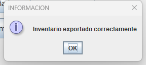
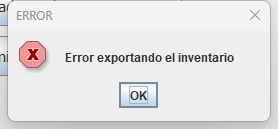
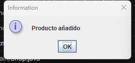
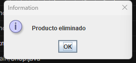
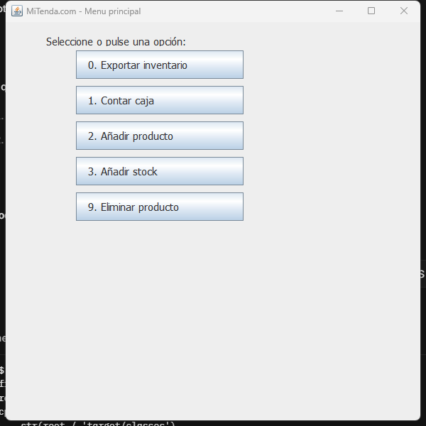
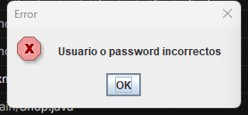

# Shop Management System

Aplicacion Java para la gestion de una tienda con control de inventario, autenticacion de empleados y una interfaz grafica sencilla conectada a MongoDB.

---

## Descripcion

Este proyecto permite gestionar operaciones basicas de una tienda:

- carga de inventario desde MongoDB,
- exportacion del inventario historico,
- alta, actualizacion y eliminacion de productos,
- login de empleados,
- acceso al menu principal de la aplicacion.

La practica actual trabaja con MongoDB para las colecciones `inventory`, `users` y `historical_inventory`.

---

## Tecnologias

- Java 17+
- Swing
- MongoDB
- Maven
- Patron DAO
- Arquitectura MVC

---

## Estructura principal

- `src/main/Shop.java`: logica principal de la tienda
- `src/view/LoginView.java`: pantalla de login
- `src/view/ShopView.java`: menu principal
- `src/view/ProductView.java`: mantenimiento de productos
- `src/dao/DaoImplMongoDB.java`: acceso a datos en MongoDB
- `src/test/java/regression/ShopRegressionTest.java`: pruebas de regresion
- `evidence/regression/`: capturas y reporte de pruebas

---

## Configuracion de MongoDB

1. Instala MongoDB Community Server.
2. Conectate a `mongodb://localhost:27017`.
3. Crea la base de datos `shop`.
4. Crea las colecciones:
   - `inventory`
   - `users`
   - `historical_inventory`

### Datos de ejemplo

#### Coleccion `inventory`

```json
{ "id": 1, "name": "Manzana", "price": 1.2, "available": true, "stock": 30 }
{ "id": 2, "name": "Pera", "price": 1.5, "available": true, "stock": 25 }
{ "id": 3, "name": "Hamburguesa", "price": 3.0, "available": true, "stock": 20 }
{ "id": 4, "name": "Fresa", "price": 2.2, "available": true, "stock": 40 }
```

#### Coleccion `users`

```json
{ "employeeId": 123, "name": "Empleado Demo", "password": "test" }
{ "employeeId": 456, "name": "Admin", "password": "admin123" }
```

### Credenciales de acceso

- Usuario de prueba: `123`
- Password: `test`

---

## Funcionalidades verificadas

Se ha preparado una regresion automatizada para validar los siguientes puntos:

1. Carga de inventario desde la coleccion `inventory`
2. Exportacion de inventario a `historical_inventory`
3. Mantenimiento del inventario en `inventory`
   - añadir producto,
   - añadir stock,
   - eliminar producto
4. Login correcto con acceso al menu principal
5. Login incorrecto con mensaje de error

El resultado detallado queda registrado en:

- `evidence/regression/regression-report.txt`

---

## Evidencias visuales de los tests

Las siguientes capturas estan en `evidence/regression/` y corresponden a los tests de regresion definidos en `src/test/java/regression/ShopRegressionTest.java`.

Su objetivo es demostrar visualmente que cada flujo principal funciona correctamente.

Tambien puedes consultar el reporte completo en:

- `evidence/regression/regression-report.txt`

### 1. Test de exportacion correcta del inventario

La aplicacion muestra un mensaje informativo cuando el inventario se exporta correctamente a la coleccion `historical_inventory`.

<p align="center">
   
</p>

---

### 2. Test de error al exportar inventario

Cuando ocurre un problema en la exportacion, la aplicacion responde con un mensaje de error.

<p align="center">
   
</p>

---

### 3. Test de alta de producto

Se verifica que al añadir un nuevo producto se muestra la confirmacion correspondiente y el documento se inserta en `inventory`.

<p align="center">
   
</p>

---

### 4. Test de actualizacion de stock

Esta evidencia muestra la actualizacion correcta del stock de un producto ya existente.

<p align="center">
   
</p>

---

### 5. Test de eliminacion de producto

La aplicacion confirma visualmente la eliminacion de un producto de la coleccion `inventory`.

<p align="center">
   
</p>

---

### 6. Test de login correcto

Cuando las credenciales son validas, el usuario accede al menu principal de la tienda.

<p align="center">
   
</p>

---

### 7. Test de login incorrecto

Si las credenciales no son correctas, la aplicacion muestra el mensaje de error correspondiente.

<p align="center">
   
</p>

---

## Resultado de la regresion

Estado actual de la bateria de pruebas:

- 8 de 8 pruebas superadas

Casos validados:

- carga de inventario,
- exportacion correcta,
- exportacion con error,
- añadir producto,
- añadir stock,
- eliminar producto,
- login correcto,
- login incorrecto.

---

## Nota

Las capturas estan almacenadas dentro del propio proyecto para facilitar la entrega, revision y defensa de la practica.
