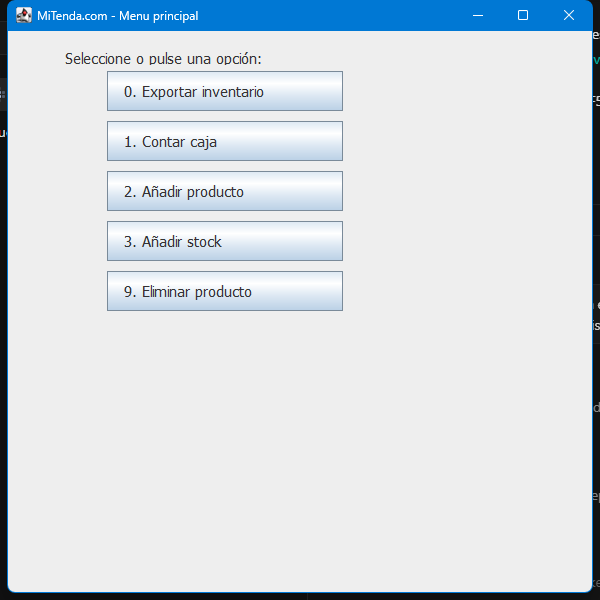
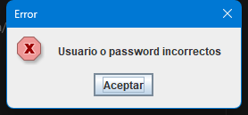

# Shop Management System - Practica 4 RA4 (ObjectDB)

Aplicacion Java para la gestion de tienda con interfaz Swing.

Estado de esta entrega:

- login refactorizado a ObjectDB (requisito Practica 4),
- regresion de login ejecutada con capturas guardadas en el proyecto.

---

## Requisitos funcionales cubiertos

1. Refactor login usando ObjectDB
2. Test unitario (regresion)
   - login correcto accede al menu principal
   - login incorrecto muestra mensaje de error

---

## Cambios tecnicos aplicados

### 1) Dependencias ObjectDB

Actualizado `pom.xml` con:

- repositorio:
  - `https://m2.objectdb.com`
- dependencia:
  - `com.objectdb:objectdb:2.9.2`

### 2) Carpeta ObjectDB

Creada carpeta:

- `objects/`

La base se crea automaticamente en:

- `objects/users.odb`

### 3) Nuevo DAO de ObjectDB

Nueva clase:

- `src/dao/DaoImplObjectDB.java`

Implementa:

- `connect()` / `disconnect()` con JPA
- `getEmployee(employeeId, password)` con JPQL
- seed automatico de usuarios por defecto si BD vacia:
  - `123 / test`
  - `456 / admin123`

### 4) Clase Employee adaptada

Modificada:

- `src/model/Employee.java`

Cambios:

- `@Entity` en la clase
- `@Id` en `employeeId`
- `@Transient` en atributo `dao`
- dao por defecto cambiado a `DaoImplObjectDB`

---

## Configuracion de datos

### Login (ObjectDB)

No requiere cargar `users` en MongoDB.

El DAO de login usa por defecto esta ruta:

- `objects/users.odb`

Si se quiere cambiar para pruebas, se puede usar la propiedad del sistema:

- `shop.objectdb.path`

Credenciales de prueba:

- `employeeId`: `123`
- `password`: `test`

## Test unitario (regresion)

Implementado en:

- `src/test/java/regression/ShopRegressionTest.java`

Este runner de regresion ejecuta unicamente los 2 casos de login solicitados en la practica.

Casos verificados:

1. Login correcto accede al menu principal (ObjectDB)
2. Login incorrecto muestra mensaje de error

---

## Evidencias y capturas

Directorio de evidencias:

- `evidence/regression/`

Reporte:

- `evidence/regression/regression-report.txt`

Capturas:

- `evidence/regression/login-ok-shopview.png`
- `evidence/regression/login-error-dialog.png`

Nota: en el directorio pueden existir capturas antiguas de otras regresiones. Para esta entrega solo aplican las dos capturas de login indicadas arriba.

### Login correcto

  

### Login incorrecto

  

---

## Resultado final

- Regresion ejecutada: OK
- Pruebas superadas: `2/2`
- Capturas guardadas: SI
- Login usando ObjectDB: SI

---

## Como ejecutar

### Aplicacion

1. Compilar el proyecto.
2. Ejecutar `view.LoginView` o `main.Shop`.
3. Probar login con credenciales por defecto:
   - `123 / test`

### Regresion de login

1. Ejecutar `regression.ShopRegressionTest`.
2. Revisar reporte en:
   - `evidence/regression/regression-report.txt`
3. Revisar capturas:
   - `evidence/regression/login-ok-shopview.png`
   - `evidence/regression/login-error-dialog.png`
