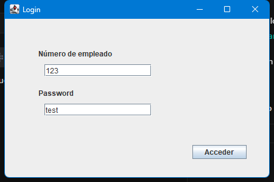
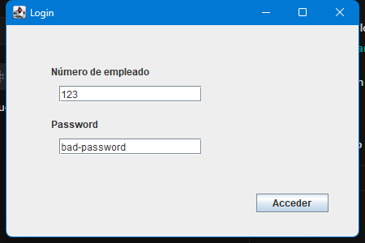

# Practica 4 RA4 - Gestion de Tienda

Modulo MP0486 - Acces a dades

Esta entrega implementa unicamente lo pedido en el PDF de la practica: refactor del login a ObjectDB y regresion de login.

---

## Documento funcional

1. Refactor login usando ObjectDB.
2. Test unitario (regresion):
   - verificar login correcto accede al menu principal;
   - verificar login incorrecto muestra mensaje de error.

---

## Documento tecnico

1. Dependencias ObjectDB en `pom.xml`:
   - repositorio `https://m2.objectdb.com`;
   - dependencia `com.objectdb:objectdb:2.9.2`.
2. Carpeta ObjectDB en raiz del proyecto:
   - `objects/`
3. Nueva clase DAO para login en ObjectDB:
   - `src/dao/DaoImplObjectDB.java`
   - implementa `Dao`
   - implementa `getEmployee(employeeId, password)` con JPQL
4. Modificacion de clase `Employee`:
   - `@Entity` en la clase
   - `@Transient` en el atributo `dao`
   - tipo de `dao` cambiado a `DaoImplObjectDB`

---

## Configuracion ObjectDB

- Base por defecto: `objects/users.odb`
- Propiedad opcional para cambiar ruta: `shop.objectdb.path`
- Usuarios semilla automaticos si la base esta vacia:
  - `123 / test`
  - `456 / admin123`

---

## Tests unitarios actuales

Implementados en `src/test/java/regression/ShopRegressionTest.java`.

Casos ejecutados:

1. Login correcto
   - introduce `employeeId=123` y `password=test`
   - valida que se abre `ShopView`
   - valida que `LoginView` se cierra
2. Login incorrecto
   - introduce `employeeId=123` y `password=bad-password`
   - valida mensaje `Usuario o password incorrectos`
   - valida que no se abre `ShopView`

Resultado esperado del runner:

- `OK - 2 pruebas superadas`

---

## Evidencias

Ruta: `evidence/regression/`

- `regression-report.txt`
- `login-ok-credentials.png` (pantalla login con credenciales correctas escritas)
- `login-ok-shopview.png` (menu principal tras login correcto)
- `login-error-credentials.png` (pantalla login con credenciales incorrectas escritas)
- `login-error-dialog.png` (mensaje de error tras login incorrecto)

### Login correcto - credenciales introducidas

  

### Login correcto - acceso al menu principal

  

### Login incorrecto - credenciales introducidas

  

### Login incorrecto - mensaje de error

  

---

## Estado de entrega

- Requisitos PDF implementados: SI
- Login con ObjectDB: SI
- Regresion login ejecutada: SI
- Pruebas superadas: `2/2`
